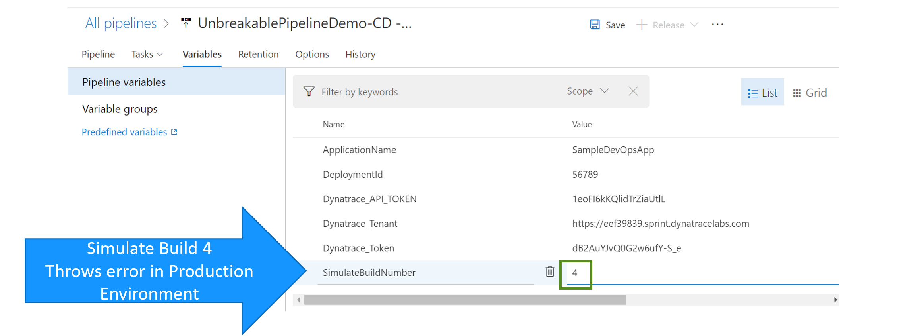
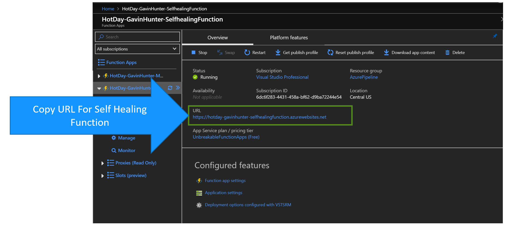
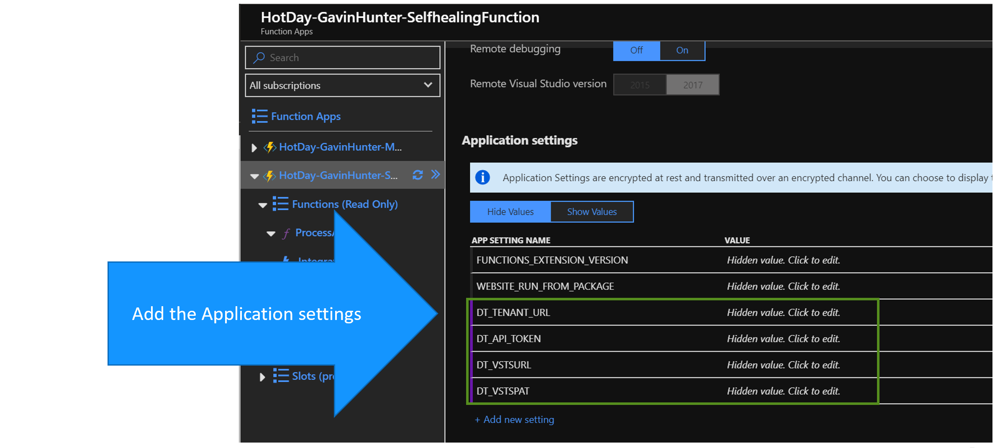
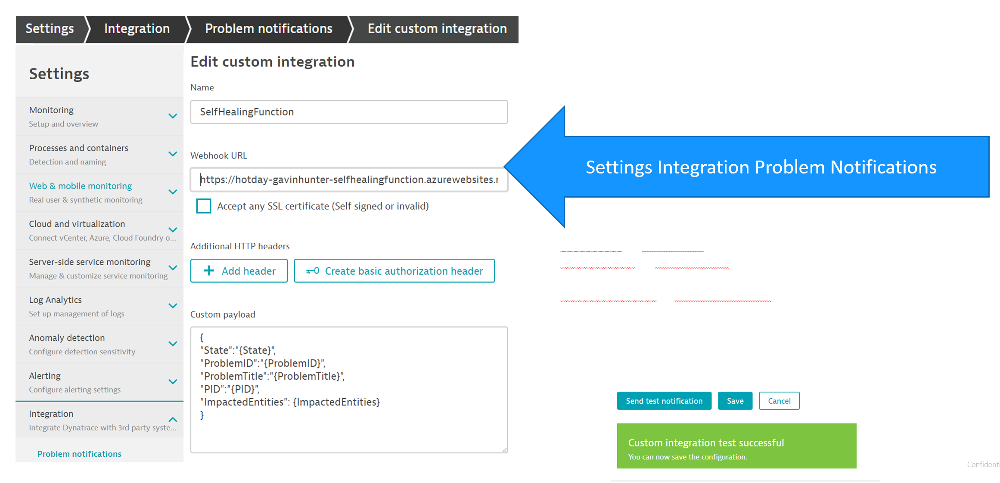
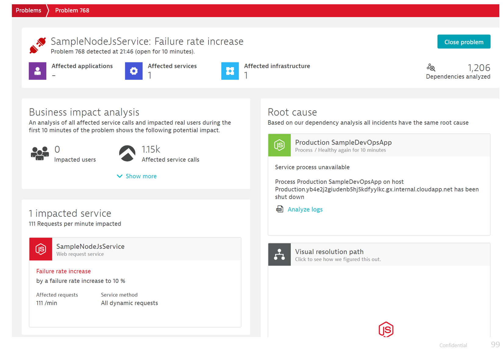
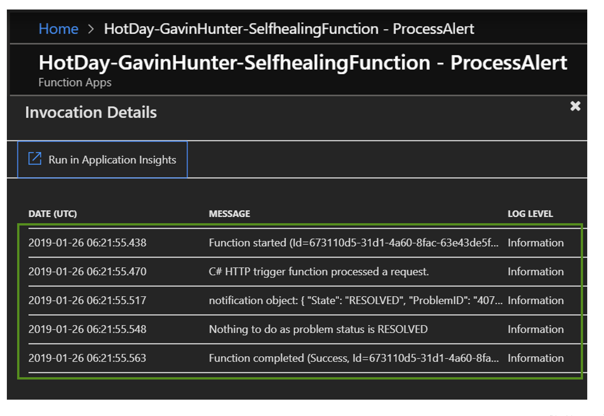
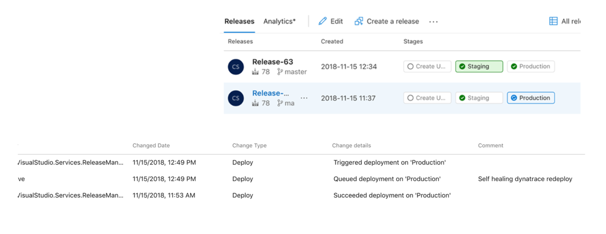

# Remediation as Code - Self Healing
The sample application is designed to throw errors in Production environment. It passes the quality gate by performing well in Staging but fails only in Production. This causes Dynatrace to create a problem Alert which calls an Azure Function. The Azure Function initializes Self Healing and reverts back a previous good release from Azure Devops


## Configuring Self Healing:
1. Get the URL for the Self Healing Function from Azure portsl

2. Add the following Environment variables under Application Settings for the Function
DT_TENANT_URL: Your Dynatrace Tenant
DT_API_TOKEN: Dynatrace API Token 
DT_VSTSURL : VSTS URL (https://yourOrg.visualstudio.com)
DT_VSTSPAT: VSTS PAT

3. Go to Dynatrace screen and add Problem Notification:

Add Custom Payload:
```json
{
"State":"{State}",
"ProblemID":"{ProblemID}",
"ProblemTitle":"{ProblemTitle}",
"PID": "{PID}",
"ImpactedEntities": {ImpactedEntities}
}
```
4. Deploy the release From Azure Devops and go to Dynatrace screen to see the Problem notification

5. GO to Azure Portal and see the Logs for the function

6. Go to Azure Devops and see the previous release being redeployed



